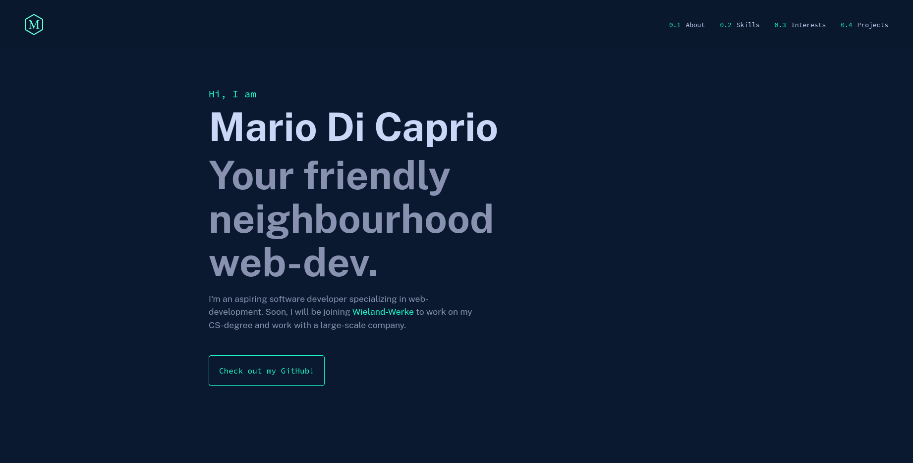
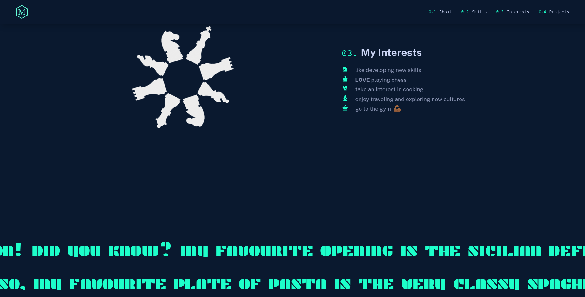
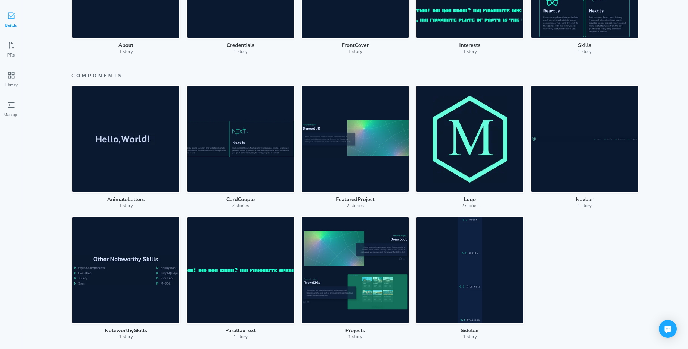

<div align="center">
    
</div>
<h1 align="center">
    mariodicaprio.vercel.app
</h1>
<p align="center">
    This website is my personal portfolio! It is a website created with the
    <a href="https://nextjs.org/" target="_blank" rel="noreferrer">Next JS</a>
    framework and hosted on
    <a href="https://vercel.com/" target="_blank" rel="noreferrer">Vercel</a>.
</p>

# Screenshots




# Tech Stack

This application was developed with the following technologies:
- [React](https://reactjs.org)
- [Next JS](https://nextjs.org)
- [Storybook](https://storybook.js.org/)
- [Framer Motion](https://www.framer.com/motion/)
- [Styled Components](https://styled-components.com/)

# Project Structure

For maintainability reasons, this project is structured in a very clear
and intuitive manner:
- Components are stored each in their own directories under `/src/components`.
  This includes, but may not be limited to:
  - The component itself
  - Styles for the component
  - Framer-Motion animations
- Pages are stored under `/src/pages`, in accordance with the Next JS
  directory structure.
- More general styles and animations, as well as styles and animations for
  individual pages, are stored under `/src/styles`
- Page stories are stored under `/src/stories`.

# Storybook

Ideally, all components have a story to view them in isolation. The storybook
for this application is deployed on [Chromatic](https://www.chromatic.com/)
and is publicly accessible [here](https://www.chromatic.com/builds?appId=6417438718d9224ca85e6f32).



Alternatively, you can run the storybook locally as follows:

1. First, install all dependencies:

```shell
yarn install
```

2. Now you can run the storybook locally:

```shell
yarn storybook
```

# Installation

1. First, install all dependencies:

```shell
yarn install
```

2. Already, you can run this project on your local machine!

```shell
yarn dev
```

3. Alternatively, you can first build this project and then run the
   compiled code:

```shell
yarn build && yarn start
```

# Color Palette

Naming conventions for each color code are as per [this](https://www.color-name.com/) tool.

| Color Name      | Color Code                                                         |
|-----------------|--------------------------------------------------------------------|
| Cool Grey       |  `#8892b0` |
| Lavender Blue   |  `#ccd6f6` |
| Sea Green       |  `#1dffca` |
| Aquamarine      |  `#64ffda` |
| Maastricht Blue |  `#0a192f` |


# Disclaimer

Many thanks to [Brittany Chiang](https://brittanychiang.com), whose website
was taken as an inspiration for this portfolio.
