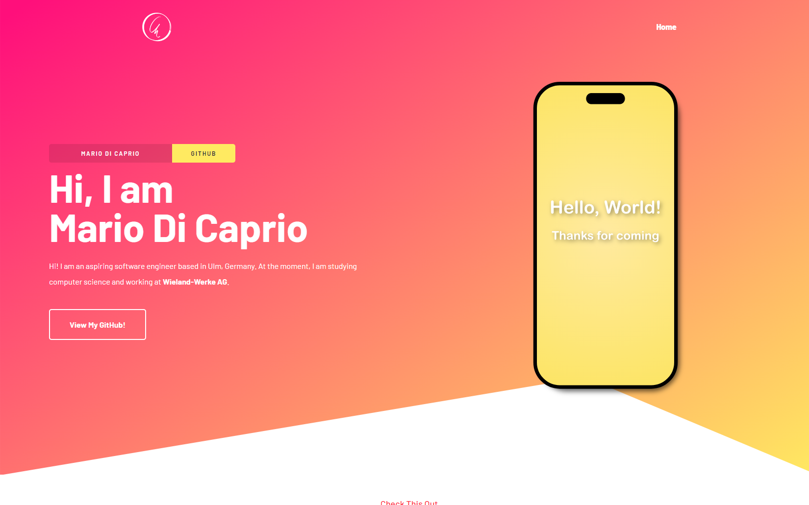
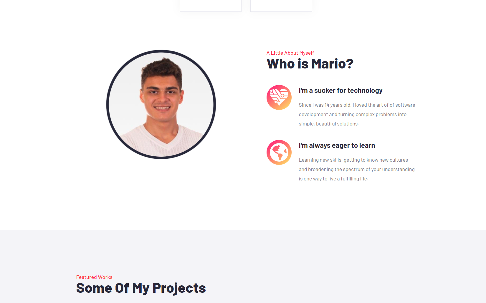

<div align="center">
    
</div>
<h1 align="center">
    mariodicaprio.vercel.app
</h1>
<p align="center">
    This website is my personal portfolio! It is a website created with the
    <a href="https://nextjs.org/" target="_blank" rel="noreferrer">Next JS</a>
    framework and hosted on
    <a href="https://vercel.com/" target="_blank" rel="noreferrer">Vercel</a>.
</p>

# Screenshots




# Tech Stack

This application was developed with the following technologies:
- [React](https://reactjs.org)
- [Next JS](https://nextjs.org)
- [Storybook](https://storybook.js.org/)
- [Material UI](https://mui.com)
- [Framer Motion](https://www.framer.com/motion/)

# Project Structure

For maintainability reasons, this project is structured in a very clear
and intuitive manner:
- Components are stored each in their own directories under `/src/components`.
  This includes, but may not be limited to:
  - The component itself
  - Styles for the component
  - Framer-Motion animations
- Pages are stored under `/src/pages`, in accordance with the Next JS
  directory structure.
- More general styles and animations, as well as styles and animations for
  individual pages, are stored under `/src/styles`.


# Installation

1. First, install all dependencies:

```shell
yarn install
```

2. Already, you can run this project on your local machine!

```shell
yarn dev
```

3. Alternatively, you can first build this project and then run the
   compiled code:

```shell
yarn build && yarn start
```

# Color Palette

Naming conventions for each color code are as per [this](https://coolors.co/) tool.
Any colors that aren't listed are either auto-generated by MUI or trivial.

| Color Name   | Color Code                                                         |
|--------------|--------------------------------------------------------------------|
| Rose         |  `#FF0F7B` |
| Maize        |  `#FFEA61` |
| Imperial Red |  `#FF2C3E` |
| Raisin Black |  `#272839` |
| Taupe Gray   |  `#7C7D8A` |
| White        |  `#FFFFFF` |

